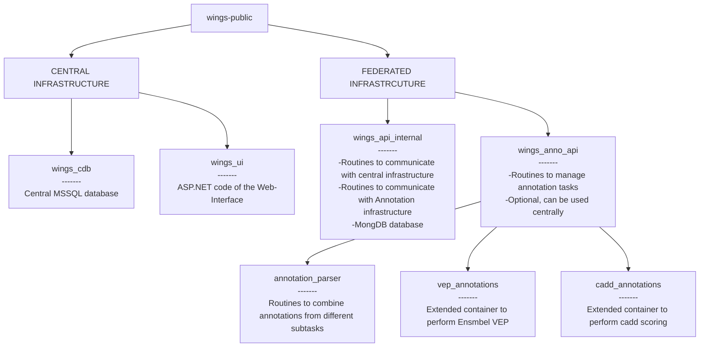

## WiNGS : The Widely Intergrated NGS platform for federated genome analysis

### Homepage

[https://wings-platform.org](https://wings-platform.org)

### What is WiNGS

WiNGS is a web-based analysis platform for Whole Exome / Whole Genome sequencing data. It is built as a federated ecosystem, where all senstivate data is kept on premise of registered users (e.g. a genetic center), and queried from a centralized user interface. This approach allows, amongst others, secure cross-center collaboration and anonymized statistical analysis. A simplified overview of the setup is shown here: 

### Setting up WiNGS

To setup WiNGS, we provide a manual [here](https://dev.azure.com/wingsorg/wings_api_deploy). In order to finalize the setup, you will have to register in the [central infrastructure](https://wings-platform.org) as well. To do so, please [contact us](mailto:geert.vandeweyer@uza.be).

### Available Repositories

Several repositories are available under this account. They are organized as follows: 

### Demo 

An overview of the capabilities of WiNGS is available on [youtube](https://www.youtube.com/watch?v=XlAMtSvBuwI)

### License
WiNGS is available under the [*GNU Affero General Public License Version 3*](https://www.gnu.org/licenses/agpl-3.0.en.html)

 

### Contact

If you have questions, feel free to reach out at [geert.vandeweyer@uza.be](mailto:geert.vandeweyer@uza.be)

