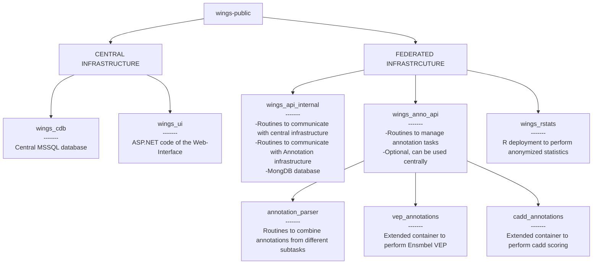

## WiNGS : The Widely Intergrated NGS platform for federated genome analysis

### Homepage

[https://wings-platform.org](https://wings-platform.org)

### What is WiNGS

WiNGS is a web-based analysis platform for Whole Exome / Whole Genome sequencing data. It is built as a federated ecosystem, where all senstivate data is kept on premise of registered users (e.g. a genetic center), and queried from a centralized user interface. This approach allows, amongst others, secure cross-center collaboration and anonymized statistical analysis. A simplified overview of the setup is shown here: 

## Components of WiNGS 

### 1. Central Infrastructure
- The web-based platform is hosted on the central infrastructure. Specific installation is not required.
- WiNGS central platform is hosted on the below infrastructure: Windows Server 2019 VM, 64GB of RAM, 16 cores with base clock at 2,60Ghz 

### 2. Client Infrastructure
- To setup Client API and Variant Annotations, we provide the mentioned manuals. [WiNGS Client API](https://dev.azure.com/wingsorg/wings_api_deploy) and [Variant annotations](https://dev.azure.com/wingsorg/wings_anno_deploy) are installed within the infrastructure of client.

## Setting up WiNGS - Process
- Interested client(genetic center) contacts WiNGS team.
- WiNGS team guides the center to setup WiNGS API within the client infrastructure.
- WiNGS API installed within the client network is linked with the central infrastructure with the specific center name (center of origin).
- In order to finalize the setup, you will have to register in the [central infrastructure](https://wings-platform.org) as well. To do so, please [contact us](mailto:geert.vandeweyer@uza.be).

### Available Repositories

Several repositories are available under this account. They are organized as follows: 

### Demo 

An overview of the capabilities of WiNGS is available on [youtube](https://www.youtube.com/watch?v=XlAMtSvBuwI)

- Demo User Account : Credentials to login to the platform(Demo Center) are included under the Supplementary section of the manuscript.

### Additional Information

#### Runing the UI Localy (dev purposes) and setting up the central database
- Clone the [central database](https://github.com/wings-public/wings_cdb), and instance it in your SQLServer. Refer [readme](https://github.com/wings-public/wings_cdb) for setup guidelines.
- Clone the [UI Code](https://github.com/wings-public/wings-ui) and allow it to connect to your DB (through config file)
- Register manually the first center into your database (Tbl Center, Tbl Center Host) and link them with your Docker container
- Run the UI and register 2 accounts into the platform (if no SMTP server is configured manually confirm your account inside the database). First account will be activated as PI and Second account will be activated as System Admin.

### License
WiNGS is available under the [*GNU Affero General Public License Version 3*](https://www.gnu.org/licenses/agpl-3.0.en.html)

 

### Contact

If you have questions, feel free to reach out at [geert.vandeweyer@uza.be](mailto:geert.vandeweyer@uza.be)

